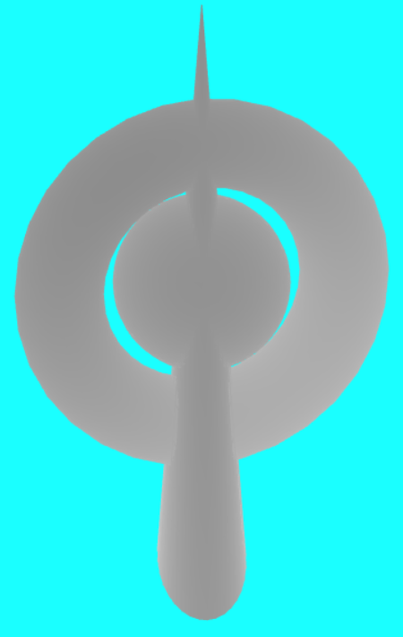
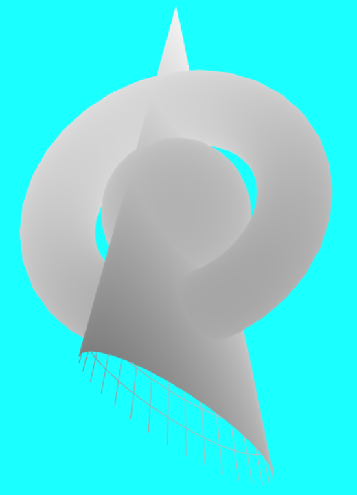
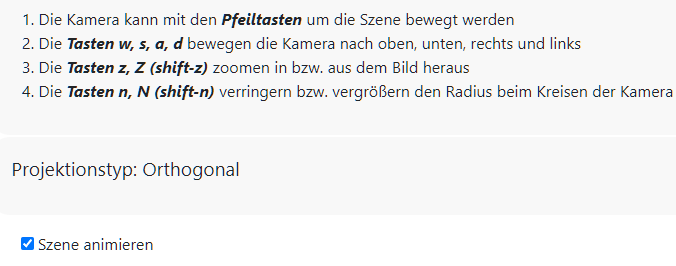

# GvtZBufferVisualization

Visualisierung von Tiefe mit Hilfe des Z-Buffers in WebGL
**Dozent: Prof. Dr. Felix Gers (Berliner Hochschule für Technik)**


---

**Graphical Visualisation Technologies**

**Dozent: Prof. Dr. Felix Gers (Berliner Hochschule für Technik)**

**Studiengang Medieninformatik Online MA, Wintersemester 2022/23**

**University of Applied Sciences Emden/Leer, Faculty of Technology, Department of Electrical Engineering and
Informatics**

---

### Einsendeaufgabe EA7 : Z-Puffer-Visualisierung

[zur Webseite](https://gvt.ckitte.de/ea7/)

Im Rahmen der siebten Einsendeaufgabe soll eine Szene mit mindestens drei, sich überschneidenden Grundkörpern erstellt und deren Tiefe visualisiert werden.

Hierfür soll die Tiefe auf Basis der **Werte im Z-Puffer** visualisiert werden. Fragmente, welche näher zur Kamera sind sollen dunkler, die weiter entfernten heller dargestellt werden. Ziel ist es, möglichst viel Tiefe zu erzeugen, sodass der Effekt deutlich wird.

Innerhalb der Anwendung sind eine **Kugel**, welche von einem sich **drehenden Torus** umgeben ist, sowie ein **Kegel** zu sehen, der sowohl den Torus als auch die Kugel durchsticht. Um das Bild etwas interessanter zu machen, wurde die Grundseite des Kegels auf **einer Achse gestreckt**. Die Tiefe der Körper wird durch den Helligkeitswert des Grautons visualisiert. Hierbei ist der Ton **umso dunkler, je näher** ein Körper der Kamera kommt.



Bei starker Neigung sieht man zum einen die nicht sichtbaren Rückseiten im Innern des Kegels als Netzlinien vor der Kugel. Wird die Neigung verstärkt, so erkennt man die Grenzen der Berechnung. Hier werden keine Farben gesetzt, weshalb die Bereiche schwarz erscheinen. 



Es zeigte sich, dass die Grautöne am einfachsten durch Anwendung der **fract** Funktion, welche den Nachkommateil einer Zahl liefert, in Kombination mit der Variable **gl_FragCoord** im **Fragment Shader** generiert werden können. Der so erhaltene Wert wird den drei Komponenten des RGB Farbraums zugeordnet, was zu einem Grauton führt. 

```
void main()  
{            
    float zbuffer = fract(gl_FragCoord.z/0.3);  
    fragColor = vec4(zbuffer,zbuffer,zbuffer, 1.0);

}
```

Durch Bewegen in der Horizontalen oder Vertikalen (**Tasten ADWS**) sowie mit Drehbewegungen (**Pfeiltasten**) ändert sich die Grauwerte je nach Ausrichtung. Ein Zoomen (**Tasten z, Z**) hat hingegen hier keine Auswirkung. Über die weiter unten sichtbare **Checkbox** kann die Animation der Szene ein- und ausgeschaltet werden.



Die Anwendung verwendet als Grundgerüst, den in der sechsten Einsendeaufgabe genutzte Code. Fast alle hier vorhandene Interaktionen sind somit auch in dieser Lösung verfügbar. 

### Aufteilung des Codes

Als externe Bibliothek zur Berechnung der Matrizen und Vektoren kommt wie bereits zuvor [**glMatrix**](https://glmatrix.net/)  (Ordner extern) zum Einsatz.

Als Startpunkt dient das Modul **app.js**, welches mit Hilfe von **Startup.js** aktiviert wird. So gut wie alle Konfigurationen und UI Handler befinden sich in **configure.js**. Die Datei **main.css** enthält alle benötigten Klassen, um die Grafik einfach einzubinden. In der Datei **layout.css** wird das Layout der Webseite selbst festgelegt. Daneben kommt Bootstrap für die Buttons zum Einsatz.

Alle allgemeinen Module befinden sich im Ordner **module**, alle Module, welche einen Körper definieren im Ordner **models**. 

Das Modul **mod_shader** enthält die Shader Dateien und ermöglicht den Zugriff darauf. Das Modul **mod_webgl** initiert WebGL und kapselt dessen Komplexität.  Für jedes Modell wurde ein Modul angelegt, welches in der Hauptsache die Erstellung des Modells (Vertices, Linien und Dreiecke) steuert.

Die Orchestrierung der Szenen, deren Anzeige sowie das Handling der Tasttatureingabe befindet sich im Hauptmodul **app.js**. 
